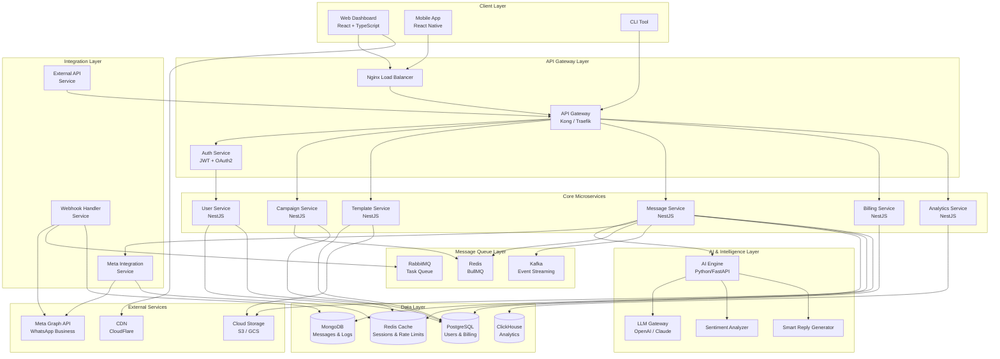
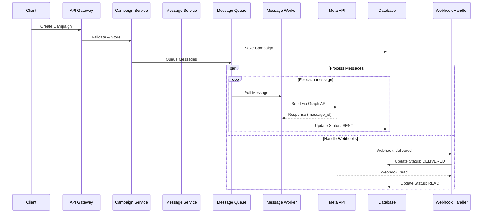
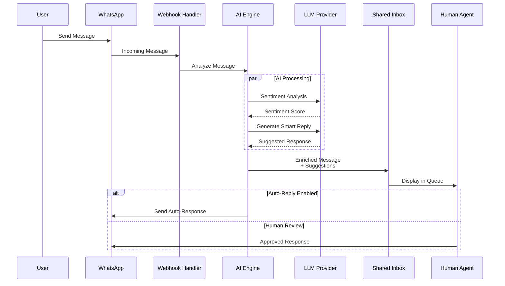
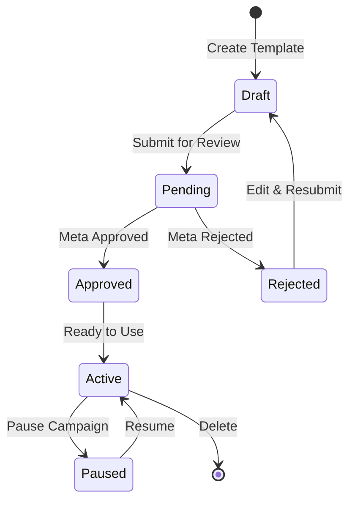
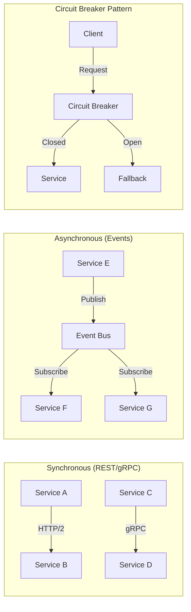
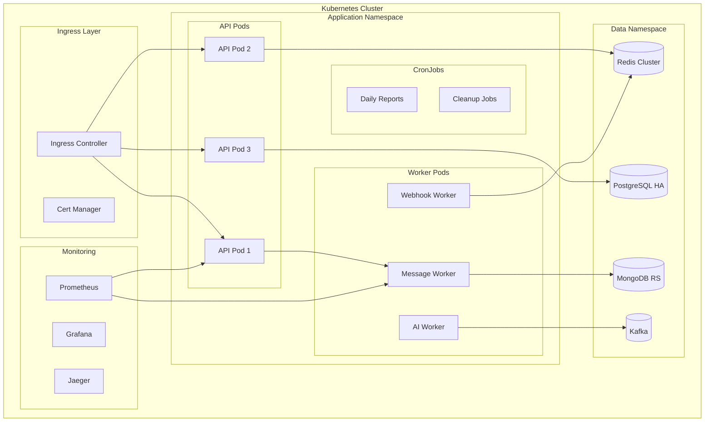
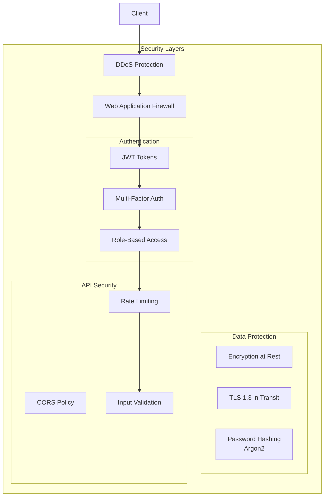

# WhatsApp BSP Platform - Architecture Diagram

## 1. System Architecture Overview (C4 Model - Level 3: Component Diagram)

## 2. Data Flow - Message Sending Flow

## 3. AI Integration Flow

## 4. Template Approval Flow

## 5. Microservices Communication Pattern

## 6. Deployment Architecture (Kubernetes)

## 7. Security Architecture

