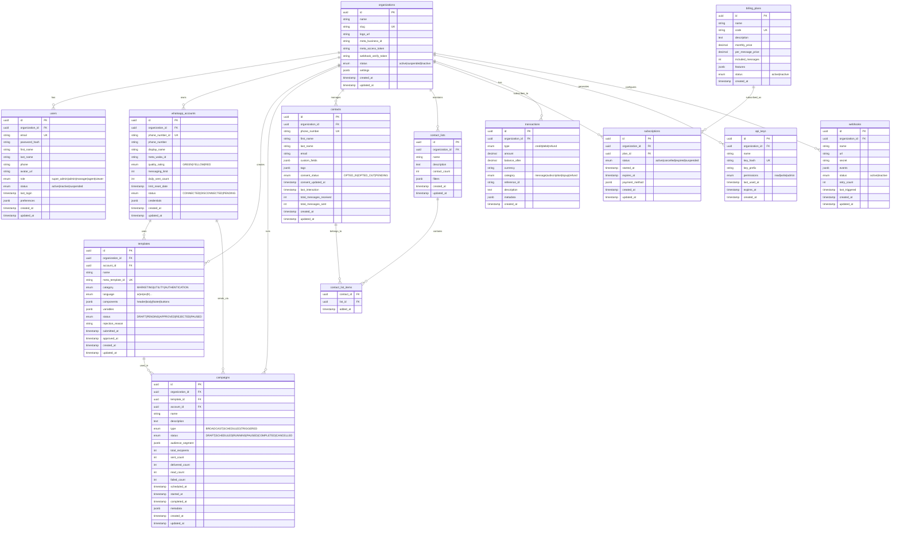

# WhatsApp BSP Platform - Database Schema Design

## 1. PostgreSQL Schema (Relational Data)



## 2. MongoDB Schema (Message Logs & Conversations)

```javascript
// Collection: conversations
{
  _id: ObjectId,
  organization_id: UUID,
  contact_id: UUID,
  account_id: UUID,
  wa_conversation_id: String, // WhatsApp conversation ID
  
  // Contact Info (denormalized for quick access)
  contact: {
    phone_number: String,
    name: String,
    profile_picture: String
  },
  
  // Conversation State
  status: String, // 'active', 'archived', 'spam'
  priority: String, // 'low', 'medium', 'high', 'urgent'
  
  // Assignment
  assigned_to: UUID, // user_id
  assigned_at: Date,
  
  // AI Analysis
  ai_analysis: {
    sentiment: String, // 'positive', 'negative', 'neutral'
    sentiment_score: Number,
    intent: String,
    language: String,
    summary: String
  },
  
  // Timestamps
  last_message_at: Date,
  last_message_preview: String,
  message_count: {
    incoming: Number,
    outgoing: Number
  },
  
  // Metadata
  tags: [String],
  source: String, // 'whatsapp', 'api', 'campaign'
  
  created_at: Date,
  updated_at: Date,
  
  // TTL Index for archiving
  expires_at: Date
}

// Indexes:
// - { organization_id: 1, last_message_at: -1 }
// - { organization_id: 1, assigned_to: 1, status: 1 }
// - { contact_id: 1 }
// - { wa_conversation_id: 1 }
// - { expires_at: 1 }, { expireAfterSeconds: 0 }
```

```javascript
// Collection: messages
{
  _id: ObjectId,
  organization_id: UUID,
  conversation_id: ObjectId,
  contact_id: UUID,
  campaign_id: UUID, // optional
  
  // Message Direction & Type
  direction: String, // 'inbound', 'outbound'
  message_type: String, // 'text', 'image', 'video', 'audio', 'document', 'location', 'template', 'interactive'
  
  // WhatsApp IDs
  wa_message_id: String,
  wa_conversation_id: String,
  
  // Content
  content: {
    text: String,
    media_url: String,
    media_mime_type: String,
    media_size: Number,
    media_caption: String,
    location: {
      latitude: Number,
      longitude: Number,
      name: String,
      address: String
    },
    document: {
      filename: String,
      url: String,
      mime_type: String
    }
  },
  
  // Template Info (if applicable)
  template: {
    id: UUID,
    name: String,
    language: String,
    parameters: [Object]
  },
  
  // Interactive Message
  interactive: {
    type: String, // 'button_reply', 'list_reply'
    button_reply: {
      id: String,
      title: String
    },
    list_reply: {
      id: String,
      title: String,
      description: String
    }
  },
  
  // Status Tracking
  status: String, // 'pending', 'sent', 'delivered', 'read', 'failed'
  status_history: [
    {
      status: String,
      timestamp: Date,
      error_code: String,
      error_message: String
    }
  ],
  
  // Delivery Info
  sent_at: Date,
  delivered_at: Date,
  read_at: Date,
  failed_at: Date,
  
  // AI Processing
  ai_processing: {
    processed: Boolean,
    sentiment: String,
    intent: String,
    suggested_replies: [String],
    auto_replied: Boolean,
    auto_reply_content: String
  },
  
  // Sender Info (for outbound)
  sent_by: {
    user_id: UUID,
    user_name: String,
    is_automated: Boolean
  },
  
  // Cost Tracking
  cost: {
    amount: Number,
    currency: String,
    category: String // 'user_initiated', 'business_initiated', 'referral_conversion'
  },
  
  // Raw webhook data (for debugging)
  raw_webhook: Object,
  
  created_at: Date,
  updated_at: Date
}

// Indexes:
// - { organization_id: 1, created_at: -1 }
// - { conversation_id: 1, created_at: 1 }
// - { wa_message_id: 1 }
// - { contact_id: 1, created_at: -1 }
// - { campaign_id: 1 }
// - { status: 1, created_at: 1 }
// - { 'ai_processing.processed': 1 }
```

```javascript
// Collection: message_logs (for high-volume logging)
{
  _id: ObjectId,
  organization_id: UUID,
  message_id: ObjectId,
  event_type: String, // 'sent', 'delivered', 'read', 'failed', 'webhook_received'
  event_data: Object,
  ip_address: String,
  user_agent: String,
  created_at: Date
}

// Indexes:
// - { organization_id: 1, created_at: -1 }
// - { message_id: 1 }
// - { event_type: 1 }
// - { created_at: 1 }, { expireAfterSeconds: 2592000 } // 30 days TTL
```

```javascript
// Collection: ai_conversations (for AI chat history)
{
  _id: ObjectId,
  organization_id: UUID,
  contact_id: UUID,
  conversation_id: ObjectId,
  
  // AI Model Info
  model: String, // 'gpt-4', 'claude-3', etc.
  system_prompt: String,
  
  // Messages
  messages: [
    {
      role: String, // 'system', 'user', 'assistant'
      content: String,
      timestamp: Date,
      tokens: Number,
      latency_ms: Number
    }
  ],
  
  // Context
  context: {
    contact_info: Object,
    conversation_summary: String,
    previous_interactions: [Object]
  },
  
  // Performance
  total_tokens: Number,
  total_cost: Number,
  
  created_at: Date,
  updated_at: Date
}
```

## 3. Redis Data Structures

```
# Rate Limiting
ratelimit:{organization_id}:{phone_number_id}  ->  Hash { count: int, reset_at: timestamp }

# Session Management
session:{token}  ->  Hash { user_id, organization_id, expires_at }

# Message Queue (BullMQ)
bull:messages:waiting  ->  List
bull:messages:active  ->  List
bull:messages:completed  ->  List
bull:messages:failed  ->  List

# Real-time Presence
presence:{organization_id}  ->  Hash { user_id: status }

# Campaign Progress
campaign:{campaign_id}:progress  ->  Hash { 
  total: int,
  sent: int,
  delivered: int,
  read: int,
  failed: int,
  estimated_completion: timestamp
}

# Cache
template:{template_id}  ->  JSON String
campaign:{campaign_id}  ->  JSON String
contact:{phone_number}  ->  JSON String

# Locks (for distributed operations)
lock:campaign:{campaign_id}  ->  String (with TTL)
lock:contact:{contact_id}  ->  String (with TTL)

# Webhook Processing
webhook:processing:{message_id}  ->  String (prevents duplicate processing)
```

## 4. ClickHouse Schema (Analytics)

```sql
-- Messages analytics table
CREATE TABLE message_analytics (
    timestamp DateTime64(3),
    organization_id UUID,
    account_id UUID,
    campaign_id UUID,
    contact_id UUID,
    message_id UUID,
    
    -- Dimensions
    direction Enum('inbound', 'outbound'),
    message_type Enum('text', 'image', 'video', 'audio', 'document', 'template', 'interactive'),
    status Enum('sent', 'delivered', 'read', 'failed'),
    
    -- Metrics
    count UInt32,
    cost Decimal64(6),
    
    -- AI Metrics
    sentiment_score Float32,
    ai_processed UInt8,
    
    -- Time dimensions
    date Date,
    hour UInt8,
    day_of_week UInt8,
    week UInt8,
    month UInt8,
    year UInt16
) ENGINE = MergeTree()
PARTITION BY toYYYYMM(timestamp)
ORDER BY (organization_id, timestamp);

-- Aggregated daily stats
CREATE TABLE daily_stats (
    date Date,
    organization_id UUID,
    account_id UUID,
    
    -- Message counts
    total_messages UInt32,
    sent_messages UInt32,
    delivered_messages UInt32,
    read_messages UInt32,
    failed_messages UInt32,
    
    -- Costs
    total_cost Decimal64(6),
    
    -- Contacts
    unique_contacts UInt32,
    new_contacts UInt32,
    
    -- AI
    ai_processed_messages UInt32,
    auto_replied_messages UInt32,
    
    -- Performance
    avg_delivery_time_ms UInt32,
    avg_read_time_ms UInt32
) ENGINE = SummingMergeTree()
PARTITION BY toYYYYMM(date)
ORDER BY (organization_id, date);

-- Real-time materialized view
CREATE MATERIALIZED VIEW message_analytics_mv
TO message_analytics
AS SELECT
    timestamp,
    organization_id,
    account_id,
    campaign_id,
    contact_id,
    message_id,
    direction,
    message_type,
    status,
    1 as count,
    cost,
    sentiment_score,
    ai_processed,
    date,
    hour,
    day_of_week,
    week,
    month,
    year
FROM messages_kafka;
```

## 5. Database Sharding Strategy


## 6. Data Retention Policies

| Data Type | Storage | Retention | Archive Strategy |
|-----------|---------|-----------|------------------|
| User Data | PostgreSQL | Forever | - |
| Message Content | MongoDB | 2 years | Compress & S3 |
| Message Logs | MongoDB | 30 days | Delete |
| Analytics | ClickHouse | 5 years | Aggregate & Archive |
| Webhook Logs | MongoDB | 7 days | Delete |
| AI Conversations | MongoDB | 90 days | Anonymize & Archive |
| Session Data | Redis | 24 hours | Delete |
| Rate Limit Counters | Redis | 24 hours | Delete |
